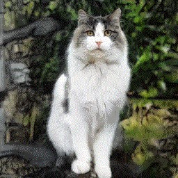
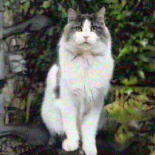
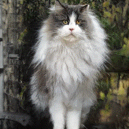

## Sketch Your Own GAN Reproduction in Jittor

We reproduced the results of the Sketch Your Own GAN project ( [**Project**](https://peterwang512.github.io/GANSketching/) | [**Paper**](https://arxiv.org/abs/2108.02774) ) in [Jittor](https://github.com/Jittor/jittor), a Just-in-time(JIT) deep learning framework, as the final project of the Artificial Neural Network course of Tsinghua University. We reproduced the metrics of the main experiment of Sketch Your Own GAN and compared the performance of Jittor and Pytorch concerning the training time.

The task of Sketch Your Own GAN is to customize a pre-trained GAN to match input sketches.

## Getting Started

### Clone our repo

```bash
git clone git@github.com:georgao35/GANSketching_Jittor.git
cd GANSketching_Jittor
```

### Install packages

- Install Jittor (https://cg.cs.tsinghua.edu.cn/jittor/) and other packages.
  
  ```bash
  pip install -r requirements.txt
  ```

### Download model weights

Run `bash weights/download_weights.sh`

You can also directly download from [here](https://cloud.tsinghua.edu.cn/f/185bb7796d5b43c0a6b4/) and extract it to <path_to_models>, which can be chosen arbitrarily in case you need to store it somewhere other than the home directory.

### Generate samples from a customized model

This command runs the customized model specified by `ckpt`, and generates samples to `save_dir`.

```bash
# generates samples from the "standing cat" model.
python generate.py --ckpt <path_to_models>/standing_cat_aug.jtr --save_dir output/samples_standing_cat

# generates samples from the cat face model in Figure. 1 of the paper.
python generate.py --ckpt weights/by_author_cat_aug.pth --save_dir output/samples_teaser_cat
```

### Latent space edits by GANSpace

The model reproduced preserves the latent space editability of the original model and can apply the same edits using the latents reported in Härkönen et.al. ([GANSpace](https://github.com/harskish/ganspace)).

```bash
# add fur to the standing cats
python ganspace.py --obj cat --comp_id 27 --scalar 50 --layers 2,4 --ckpt weights/photosketch_standing_cat_noaug.pth --save_dir output/ganspace_fur_standing_cat
```

## Model Training

Training and evaluating on model trained on PhotoSketch inputs requires running [the Precision and Recall metric](https://github.com/kynkaat/improved-precision-and-recall-metric). The following command pulls the submodule of the forked Precision and Recall [repo](https://github.com/PeterWang512/precision_recall).

```bash
git submodule update --init --recursive
```

### Download Datasets and Pre-trained Models

The following scripts downloads our sketch data, our evaluation set, [LSUN](https://dl.yf.io/lsun), and pre-trained models from [StyleGAN2](https://github.com/NVlabs/stylegan2) and [PhotoSketch](https://github.com/mtli/PhotoSketch).

```bash
# Download the sketches
bash data/download_sketch_data.sh

# Download evaluation set
bash data/download_eval_data.sh

# Download LSUN cat, horse, and church dataset
bash data/download_lsun.sh

# load pretrained model
bash pretrained/download_pretrained_models.sh
```

### Training Scripts

The example training configurations are specified using the scripts in `scripts` folder. Use the following commands to launch trainings.

```bash
# Train the "standing cat" model with augmentation
bash scripts/train_standing_cat.sh

# Train the "standing cat" model without augmentation
bash scripts/train_standing_cat_noaug.sh

# Train the "gabled church" model with augmentation
bash scripts/train_church.sh

# Train the "gabled church" model without augmentation
bash scripts/train_church_noaug.sh
```

The training progress is tracked using `wandb` by default. To disable wandb logging, please add the `--no_wandb` tag to the training script.

### Evaluations

Please make sure the evaluation set and model weights are downloaded before running the evaluation.

```bash
# You may have run these scripts already in the previous sections
bash weights/download_weights.sh # You can download models in either way.
bash data/download_eval_data.sh
```

Use the following script to evaluate the models, the results will be saved in a csv file specified by the `--output` flag. `--models_list` should contain a list of tuple of model weight paths and evaluation data. Please see `weights/eval_list` for example.

```bash
python run_metrics.py --models_list <path_to_models>/eval_list --output metric_results.csv --model_root <path_to_models>
```

## Results

We reproduced the FID metric for the standing cat and gabled church dataset using the "Full without augmentation" and the "Full with augmentation model" specified by [the original paper]((https://arxiv.org/abs/2108.02774)). To reproduce the metrics in our project report, run the following command:

First download our [models](https://cloud.tsinghua.edu.cn/f/185bb7796d5b43c0a6b4/) and extract to a certain path <path_to_models>

Then make sure you have downloaded eval data with command

```bash
bash data/download_eval_data.sh
```

At last run this to get the result.

```bash
python run_metrics.py \
--models_list <path_to_models>/eval_list \
--model_root <path_to_models> \
--output metric_results.csv
```

(note: There may be environment problems regarding jittor, pytorch and certain version of cuda tools on certain machines. In that case, you can first run `python jtr_to_pth.py <path_to_models>/<model_name>.jtr` to first convert the model to a PyTorch model and replace `run_metrics.py` with `run_metrics_pt.py` to get the results.)

We made an off-line demo for adding fur on the given cat image. Run the following command to generate a gif recording the adding-fur process:

```bash
python ganspace_gif.py --obj cat --comp_id 27 \
--scalar 50 --layers 2,4 --frames 20 \
--ckpt <path_to_models>/standing_cat_aug.jtr \
--save_dir <path_to_save_pictures>
```

An example adding-fur gif is shown as follows:

| Image 1                   | Interoplation             | Image 2                               |
| ------------------------- | ------------------------- | ------------------------------------- |
|  |  |  |

## Acknowledgments

The code and README description of this repository borrows partly from [the Sketch Your Own GAN project](https://github.com/PeterWang512/GANSketching). We also acknowledged the developers of [Jittor](https://github.com/Jittor/jittor) for answering our technical questions about the usage of Jittor.
